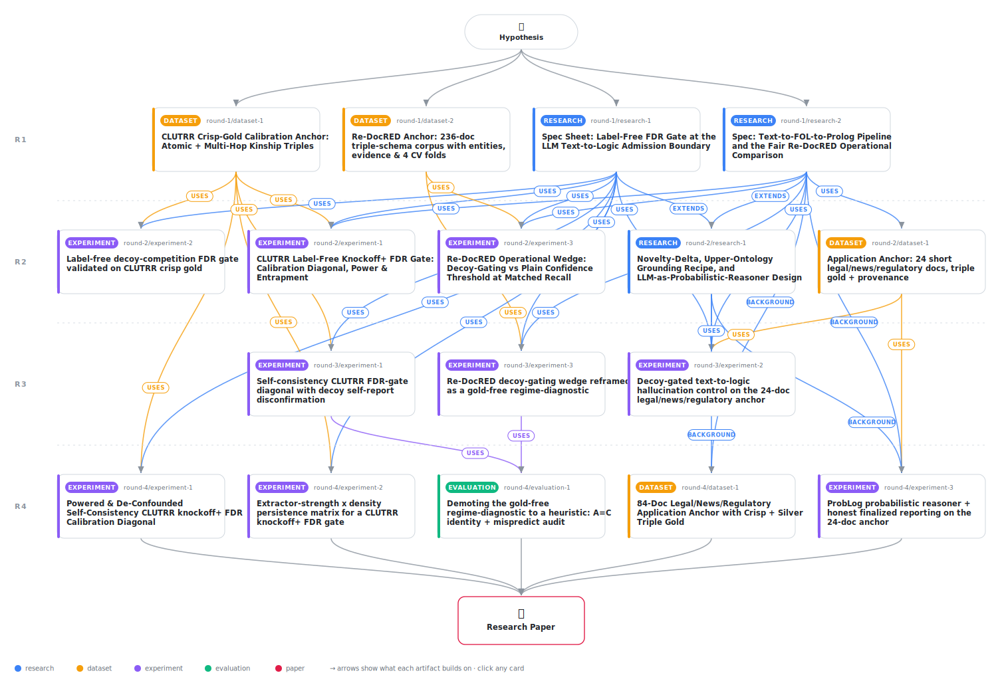

# Decoy-Gated Neuro-Symbolic Extraction: A Label-Free FDR Gate at the Text-to-Logic Boundary and the Exchangeability Gap That Bounds It

<div align="center">

<a href="https://cdn.jsdelivr.net/gh/AMGrobelnik/ai-invention-6db730-decoy-gated-neuro-symbolic-extraction-a@main/workflow.svg">
<picture>
  <source media="(prefers-color-scheme: dark)" srcset="workflow-dark.svg">
  
</picture>
</a>

<sub>🖱️ <b><a href="https://cdn.jsdelivr.net/gh/AMGrobelnik/ai-invention-6db730-decoy-gated-neuro-symbolic-extraction-a@main/workflow.svg">Open the interactive diagram</a></b> — every card links to its artifact folder.</sub>

</div>

> **TL;DR** — This paper builds the first label-free FDR gate at the LLM text-to-logic admission boundary by importing knockoff/target-decoy competition, then rigorously executes and reports its limits. Re-running the calibration diagonal under the diagnostic-validated self-consistency elicitation, the gate's FDR certificate is disconfirmed on the error-dense CLUTRR multi-hop family (realized FDR 1.0 at the only certifiable alpha*=0.5), and the cause is localized precisely: self-consistency restores marginal decoy exchangeability (decoy distribution matches the model's spontaneous errors, KS p=0.058) but not the paired sign-flip property knockoff+ requires, so a marginal win-rate diagnostic over-certifies the gate. Despite the missing certificate, the operational pipeline delivers the goal's deliverables: on a genre-faithful 24-document legal/news/regulatory anchor it cuts the corrupted multi-hop conclusion rate from 0.48 to 0.18 and the atomic hallucination rate ~25% (directional) with conservative self-report and exported auditable trace-graphs; and a new gold-free regime-diagnostic correctly predicts the null operational wedge on 152 Re-DocRED documents. The contribution is a reproducible (~$2.6, commodity CPU) map of where decoy gating helps, where it is redundant, and where its certificate breaks.

<details>
<summary>Full hypothesis</summary>

MECHANISM (unchanged, one sentence). Before any LLM-proposed Prolog FACT or fuzzy-unification BRIDGE rule enters a knowledge base, it must out-score a plausibility-matched synthetic DECOY (a candidate the model finds plausible but the document does not entail) in a target-decoy / knockoff+ competition; the gate admits the most permissive cutoff whose estimated corpus-aggregate false-admission rate (FDR) is at most a target alpha, using ZERO operation labels.

WHAT IS NOW EXECUTED (iteration-3, MEASURED). Three experiments ran for ~$1.4 this iteration (~$2.6 cumulative of the $10 cap): (P1) the self-consistency CLUTRR calibration diagonal [art_sBLQqsdm3EIA] -- BUT on a 40-doc CHECKPOINT (410 reals: 123 true / 287 spontaneous false), NOT the powered ~593-doc run the artifact itself names as the intended final version; (P2) the 24-doc legal/news/regulatory APPLICATION headline [art_vkfyOl2OQNVx], executed end-to-end with auditable trace-graphs (210 reals: 42 true / 51 false / 117 gold-undecidable); (P3) the Re-DocRED operational wedge scaled to 152 confirmatory docs and reframed as a gold-free regime-diagnostic [art_RZC2468yZ-Jh]. Iteration-4's job is NOT to re-build but to POWER and DE-CONFOUND the central finding, SCALE the application to statistical significance, and execute the still-missing probabilistic reasoner the goal hard-requires.

THE DECISIVE FINDING (what the evidence now says, honestly). The central scientific contribution has SHIFTED from 'elicitation-dependence' to a sharper, deeper distinction -- but that finding is currently CONFOUNDED and UNDERPOWERED, which dictates the entire iteration-4 mandate.
  (1) THE HEADLINE CONCEPTUAL LESSON IS MARGINAL != PAIRED EXCHANGEABILITY. Under the diagnostic-validated K=5 self-consistency elicitation, the counterfactual-decoy score distribution is statistically indistinguishable from the model's OWN spontaneous-error distribution (full-dist KS p=0.058, MW p=0.061, AD p=0.061, perm p=0.060 -- all FAIL to reject; admission-tail top-25% KS p=0.31) and sharply distinct from true positives (KS p=5e-9, MW p=4e-12). That is MARGINAL (distributional) exchangeability -- exactly the property DeepCoy-style decoy design and the win-rate/CDF diagnostics target, and it HOLDS. Yet knockoff+ requires the strictly stronger PER-PAIR sign-flip property at the cutoff, and it FAILS: among the 12 admitted multi_hop reals the model scored EACH false real above its own matched decoy, so realized FDR is 1.0 at the only certifiable alpha*=0.5 (doc-block CI [0.66,1.0] entirely above alpha*) and the gate's self-report decoy_fdr_hat=0.5 undershoots realized 1.0. The pre-registered primary disconfirmation FIRES on both calibration and self-report criteria. The win-rate diagnostic, being a MARGINAL statistic, structurally cannot see this gap.
  (2) THE DISCONFIRMATION IS CONFOUNDED WITH A PATHOLOGICAL EXTRACTOR AND IS UNDERPOWERED -- so the 'limitation of the entire decoy-competition approach' claim is NOT YET EARNED. The multi_hop family is ~85% genuinely false ONLY because gpt-4.1-nano's forced multi-hop relation accuracy is 0.169 (n_false 158/186) -- a regime where a tiny model essentially cannot score its own multi-hop errors at all. Realized FDR 1.0 (all 12 admitted false) and the paired sign-flip failure may therefore reflect 'this extractor is too weak for ANY admission method to help' rather than an intrinsic property of decoy-gating at the LLM boundary. Compounding this, EVERY affirmative number rests on thin power: 40 docs / 12 admitted pairs, crux p-values all within ~0.01 of rejecting (0.058-0.061), the S1b ladder has only 2 false pairs/rung. A reviewer cannot distinguish 'knockoffs fundamentally do not transfer' from 'this single weak-model, single-family checkpoint is too noisy to conclude anything.' DE-CONFOUNDING + POWERING this is the single change that most increases the credibility and reach of the headline lesson.
  (3) THE ONLY WELL-POWERED RESULT IS NEGATIVE-OPERATIONAL, AND THE APPLICATION HEADLINE IS DIRECTIONAL-ONLY. On 152 Re-DocRED docs the operational wedge over plain thresholding is cleanly DISCONFIRMED at recall<=0.075 ('thresholding-is-enough when the base scorer is calibrated'), and its 267-conclusion multi-hop comparison is genuinely powered (halluc rate ~0.79 both systems, delta -0.004, CI [-0.018,0.008]). On the 24-doc application anchor the ~25% relative atomic hallucination reduction (gate 0.183 self-consistency / 0.178 logprob vs raw 0.243) reaches CI separation in 0 of 40 cells, and the multi-hop corruption drop (0.48->0.18) is 11 vs 23 derived conclusions with NO CI and is driven entirely by the regulatory genre (regulatory 12->3; legal already 0.0; news derives 0). The honest unifying principle survives: the gate adds value only where the base elicitation is tail-overconfident AND decoys are paired-exchangeable, and is redundant where the base scorer is already calibrated -- but every quantitative leg of that principle needs power it currently lacks.

THE ONE THING THAT MATTERS NOW (iteration-4 mandate, in priority order).
  P1 -- POWER AND DE-CONFOUND THE CALIBRATION DIAGONAL (this is the headline experiment). (a) POWER: execute the full ~593-doc self-consistency CLUTRR diagonal the artifact already specifies, so the disconfirmation and the marginal-exchangeability crux p-values are NOT borderline (target: crux full-dist tests clearly fail-to-reject or clearly reject with n well above the current 12-pair tail; report the realized-FDR-vs-alpha diagonal with decoy_fdr_hat vs realized vs alpha across the certified grid). (b) DE-CONFOUND -- the decisive addition: run at least one diagonal with a STRONGER extractor (or a less error-dense family, or a controlled construction that VARIES false-positive density across, e.g., 20% / 50% / 85% genuine-false) and measure whether the PER-PAIR sign-flip failure PERSISTS. If the paired failure survives across extractor strength and false-positive density, the 'marginal != paired is a property of the LLM boundary' lesson is EARNED and becomes the paper's headline; if it vanishes with a competent extractor (i.e. the gate then controls realized FDR at alpha), SCOPE the claim to the error-dense/weak-scorer regime and report the positive 'gate works when the extractor can score its own errors' result instead. Either outcome is publishable; the current single-point observation is not. (c) Add a PAIRED-exchangeability statistic (per-pair win-rate over FALSE pairs at the cutoff) reported DISTINCTLY from the marginal win-rate, and compute it ACROSS the (G,S) configs (see de-circularization below).
  P2 -- ESTABLISH THE APPLICATION HEADLINE AT CI SEPARATION (the goal's binding deliverable). Scale the 24-doc legal/news/regulatory anchor toward statistical significance: more documents per genre AND a cleaner crisp-gold subset to shrink the 117/210 gold-undecidable fraction, until at least the POOLED hallucinated-fact reduction (gate vs raw LLM) reaches document-block-bootstrap CI separation; report the multi-hop corruption result WITH CIs and an explicit single-genre-origin flag. Until CI separation is reached, state PLAINLY at the point of claim that the reduction is DIRECTIONAL and not significant at the current n, and that the binding deliverable is demonstrated as a trend with auditable provenance, not a significant reduction. Continue exporting per-leaf-certified trace-graphs across all genres and elicitations and the full alpha grid.
  P3 -- LEAD WITH THE CONCEPTUAL RESULT; DEMOTE THE REGIME-DIAGNOSTIC. Make MARGINAL-vs-PAIRED exchangeability (P1) the paper's primary novel contribution. Acknowledge EXPLICITLY that the regime-diagnostic's signals are not independent -- signal C (frac(W==Z)=0.939, admitted-set Spearman rho=0.991) is mechanically the SAME quantity as signal-A tail win-rate, because W_i=Z_i exactly when the real out-scores its decoy, so 'the gate keeps and orders the same facts as the plain threshold, so the wedge is mechanically null' is close to a restatement of the realized null, not an independent forecast -- and either (a) DEMOTE the regime-diagnostic to a heuristic (default) or (b) validate it predictively on several additional anchors/regimes with a genuine held-out evaluation so the 2-axis map rests on more than 2-3 points. Do NOT present a near-mechanical observation as a forecast.
  P4 -- EXECUTE THE PROBABILISTIC REASONER (goal hard-requirement, currently only specified). Run even a MINIMAL ProbLog probabilistic-reasoning step on one anchor using the exact get_evaluatable().create_from(...).evaluate() swap and certificate->weight mapping already specified [art_Cr6L9JpoewZi], so the LLM-as-probabilistic-reasoner / fuzzy-unification requirement is DEMONSTRATED rather than only designed. If it cannot run, state in the CONTRIBUTIONS (not only limitations) that the probabilistic layer is future work, so the abstract/intro never imply it is delivered.

THE GATE (one canonical statistic; unchanged). For each candidate i with real score Z_i and matched-decoy score Z~_i, the competition statistic is the knockoff+ signed maximum W_i = sign(Z_i - Z~_i) * max(Z_i, Z~_i). knockoff+ thresholding scans cutoffs t and admits {i : W_i >= t} at the most permissive t whose estimated FDR = (1 + #{W_i <= -t}) / max(1, #{W_i >= t}) <= alpha. NEW reporting requirements: (i) ALWAYS report the gate's internal estimate decoy_fdr_hat alongside realized FDR and alpha, so 'the estimate is anti-conservative' (decoy_fdr_hat < realized) is surfaced as its own failure mode; (ii) report the MARGINAL diagnostic (pooled decoy-vs-spontaneous-error win-rate / CDF tests) and the PAIRED diagnostic (per-pair win-rate over false pairs at the cutoff) SEPARATELY, because the central finding is precisely that the marginal can hold while the paired fails.

VALIDITY HONESTY (now empirically grounded). knockoff+ delivers a finite-sample FDR GUARANTEE only under the joint-null PAIRED sign-flip property; for LLM decoys that property is UNPROVABLE. The iteration-3 evidence localizes the failure to a two-layer structure: a MARGINAL layer (decoy scores distributed like the model's spontaneous errors), which is label-free testable and which self-consistency RESTORES; and a PAIRED layer (false real and its decoy equally likely to take the larger score AS A PAIR), which the knockoff theorems actually require and which FAILS at the cutoff on the current evidence. The realized-FDR-vs-alpha diagonal IS the empirical test of the paired layer. The standard decoy-quality diagnostics imported from genomics/proteomics live entirely in the marginal layer and therefore OVER-CERTIFY the gate. CRITICAL CAVEAT carried into iteration-4: this two-layer story is, on present evidence, observed in ONE weak-extractor, error-dense, 12-pair regime; it is asserted as the paper's headline ONLY if P1's de-confounding shows the paired failure persists across extractor strength / false-positive density. If it does not persist, the validity story is re-scoped to the weak-scorer regime and the positive 'controls FDR with a competent extractor' result leads instead. The document-block bootstrap supplies realized-FDP CIs and a dependence diagnostic; it does NOT restore the guarantee.

THE DIAGNOSTIC BLIND SPOT (materially qualifies the 'self-detecting gate' contribution). The headline was once 'tail diagnostics tell the practitioner which regime they are in.' Two faces of a blind spot remain: (1) STRUCTURAL -- a MARGINAL win-rate cannot certify PAIRED validity, period (this is the conceptual core, not a power issue). (2) UNDERPOWERED -- the S1b difficulty ladder L0..L4 has only 2 false pairs/rung, so its verdict (PARTIAL) is noise; the prior narrative that 'the diagnostic detects only grossly out-of-context (foreign-entity) decoys' is in fact CONTRADICTED by the artifact (L0 foreign-swap detected_anti_conservative=FALSE while L1-L4 in-distribution rungs=TRUE) and must be either powered or restated purely as 'underpowered, cannot localize which decoy classes are detected, cannot certify paired validity.' CLAIM S1b stands: a usable self-detecting gate REQUIRES a diagnostic that retains discriminating power in the valid regime AND that probes the PAIRED layer; iteration-4 supplies a powered paired-exchangeability diagnostic or reports the blind spot as a fundamental limitation and downgrades the 'tells you when to trust the gate' claim accordingly.

DE-CIRCULARIZATION (MARGINAL settled; PAIRED not yet evidenced). The Generator!=Scorer ablation is ROBUST for the MARGINAL tail win-rate across all four (G,S) configs incl. decoys from gpt-4.1-nano scored by cross-family ministral-8b (CIs cover 0.5, e.g. 0.491 [0.37,0.61], KS p=0.999), so restored marginal exchangeability is NOT a shared-model artifact. HOWEVER -- a rigor gap surfaced this iteration -- the ablation tests ONLY the marginal statistic; the PAIRED sign-flip property has NOT been tested across (G,S) configs, so paired-failure robustness to G!=S is currently ASSERTED, not evidenced. Iteration-4 must either compute the paired-exchangeability statistic across the (G,S) configs to actually support de-circularization for the paired layer, or explicitly soften the claim to 'only marginal robustness to G!=S is demonstrated.'

POWER (the binding gate for every affirmative claim). Phase-0 must demonstrate, UNDER SELF-CONSISTENCY, that the certified grid extends below the loose alpha*=0.5 (>= 1/alpha admissions AND >= N_false_min=40 genuine false admissions among reals) on the SCALED corpus before the diagonal is asserted at tighter alpha; the ~593-doc run is the vehicle. Crux full-distribution tests must move off the borderline; the application reduction must reach CI separation on the pooled metric; the corruption result must carry CIs. Any alpha / cell whose power floor is not reached is reported as a precondition, NEVER as 'confirmed by conservatism.'

SCOPE / GOAL ALIGNMENT (the application is the binding deliverable). The goal targets ~3000-character professionally written legal/news/regulatory documents, upper-ontology grounding, an LLM probabilistic-reasoning engine at fuzzy unifications, auditable trace-graphs, and a QUANTIFIED hallucination reduction vs raw LLM. CLUTRR (synthetic kinship, crisp gold) hosts the powered+de-confounded calibration diagonal and the marginal-vs-paired lesson; Re-DocRED (Wikipedia prose, human gold) hosts the well-powered operational comparison; the 24-doc professional slice [art_UBTwyePql8NQ] hosts the application headline (WordNet->SUMO typing standing in for the discontinued OpenCyc, used ONLY for typing; minimal ProbLog probabilistic step; hallucination-reduction vs raw across both elicitations and all alpha; per-leaf-certified trace-graphs). If the application reduction cannot reach CI separation after scaling, report it as a directional trend with auditable provenance, never as a significant reduction.

CLAIM CHAIN (each row independently testable; verdicts reflect iteration-3 evidence and the iteration-4 mandate).
  | # | CLAIM | STATUS | ITERATION-4 ACTION / PASS CRITERION |
  |---|-------|--------|-------------------------------------|
  | S0 | Score separation via tail-exchangeability SELECTION (not AUC) | PASS | confirm under the elicitation hosting the powered diagonal; verbalized/DINCO higher AUC (0.861/0.871) but fail the tail test; self-consistency tail win-rate 0.482 |
  | S1 | MARGINAL decoy match (decoy ~ spontaneous error, != true positive) | HOLDS but BORDERLINE/UNDERPOWERED (KS p=0.058 etc., 12-pair tail) | power to clearly fail-to-reject (or reject) on the ~593-doc run |
  | S1c (NEW, HEADLINE) | MARGINAL != PAIRED: marginal holds while per-pair sign-flip fails at the cutoff | OBSERVED but CONFOUNDED (weak extractor acc 0.17, error-dense, 12 pairs) | DE-CONFOUND across extractor strength / false-positive density; if paired failure persists -> earned headline; else scope to weak-scorer regime |
  | S1b | Diagnostic sensitivity / paired-layer detectability | FAIL/UNDERPOWERED (2 false pairs/rung; prior narrative contradicted by data) | power the ladder or report as purely underpowered; supply a paired-exchangeability diagnostic or report fundamental limitation |
  | S2 | Calibration diagonal (CLUTRR, self-consistency) | DISCONFIRMED on 40-doc checkpoint (realized 1.0 at alpha*=0.5, CI [0.66,1.0]) but UNDERPOWERED+CONFOUNDED | power to ~593 docs + de-confound; report decoy_fdr_hat vs realized vs alpha across certified grid |
  | S2-self | Gate self-report tracks realized | DISCONFIRMED on CLUTRR multi_hop (decoy_fdr_hat=0.5 < realized 1.0); CONSERVATIVE on application (>=realized in all 40 cells) | report both regimes; surface anti-conservative self-report as its own failure mode |
  | S2b | Generator!=Scorer de-circularization | MARGINAL ROBUST (4/4 cover 0.5); PAIRED NOT YET TESTED | compute the PAIRED statistic across (G,S) configs OR soften to 'marginal-only' |
  | S3 | Entrapment corroboration | AGREES loosely (FDP_hat high, e.g. application pooled 0.81 at alpha=0.5, honestly flagging loose admission) | report at alpha* and 0.5; restrict agreement claims to where they hold |
  | S4 | Operational wedge (Re-DocRED) | DISCONFIRMED, WELL-POWERED (152 docs, recall<=0.075; 267-conclusion multi-hop delta -0.004, CI [-0.018,0.008]) | stands; 'thresholding-is-enough when base scorer calibrated' |
  | S4b | Application hallucination reduction (professional docs) -- BINDING DELIVERABLE | EXECUTED but DIRECTIONAL (gate 0.183/0.178 vs raw 0.243 ~25%; 0/40 cells CI-separated); corruption 0.48->0.18 (11 vs 23, single-genre, no CI) | scale to POOLED CI separation; cleaner crisp gold to shrink 117/210 undecidable; corruption with CIs + single-genre flag |
  | S4c | Gold-free regime-diagnostic | NOVEL but PARTLY TAUTOLOGICAL (signal C == signal A; Re-DocRED prediction near-forced) | acknowledge A/C redundancy; demote to heuristic OR validate predictively on >=3 held-out anchors |
  | S7 (NEW) | LLM-as-probabilistic-reasoner (ProbLog) at fuzzy unifications | SPECIFIED, NOT RUN | execute a minimal ProbLog run on one anchor (get_evaluatable().evaluate(), certificate->weight) OR state as future work in contributions |
  | S5 / S6 | Document-level predictive account / predictable propagation | leftover-only | predictive IFF >= N_min held-out units; else descriptive |

VALIDITY OF THE TWO-LAYER NOVELTY (positioning). To our knowledge this is the first demonstration that, when knockoffs/target-decoy competition are transplanted to LLM scoring, the MARGINAL property the cheminformatics/proteomics decoy-quality diagnostics target (DeepCoy, win-rate/CDF) can be satisfied while the PAIRED sign-flip property the knockoff theorems require is violated -- so a marginal diagnostic over-certifies the gate. All nearest neighbors (conformal factuality/selection/coherent-factuality, multiple-testing hallucination detection, conformal e-value novelty, conformal link prediction) are LABELED, certify a model OUTPUT, and ASSUME exchangeability; ours is label-free, certifies the INTERMEDIATE admission boundary, and empirically TESTS exchangeability -- and finds the marginal-vs-paired gap. This conceptual contribution is asserted as the headline ONLY after P1's powering+de-confounding; otherwise it is reported as a scoped observation in the weak-extractor regime.

BUDGET (unchanged ceiling, far underspent). ~$2.6 of the $10 cap spent cumulatively. Isolated provenance-blinded scoring with document-prefix prompt caching remains default; cumulative LLM cost logged after every call; HARD STOP at $10. Waterfall ORDER: (P1) powered+de-confounded self-consistency diagonal with the paired statistic across (G,S); (P2) scaled application reduction to CI separation + minimal ProbLog (P4); (P3) demote/validate the regime-diagnostic; then S5/S6/floor-relaxation leftover-only.

SCOPE OF CLAIMS. The honest central claim is now: a label-free FDR gate at the text-to-logic admission boundary is EXECUTABLE; its certified-FDR validity decomposes into a MARGINAL layer (label-free testable, restored by self-consistency) and a PAIRED layer (required by knockoff+, observed to fail at the cutoff in a weak-extractor error-dense regime), so a marginal diagnostic over-certifies it; whether the paired failure is intrinsic to the LLM boundary or specific to weak extractors / error-dense families is THE open question iteration-4 resolves by de-confounding; the gate's operational value over plain thresholding is NULL where the base scorer is calibrated (well-powered on Re-DocRED) and its application hallucination-reduction is currently a directional trend with auditable provenance pending scaling to CI separation. Facts AND bridges carry the claim.

MOTIVATION (unchanged core). Text-to-logic pipelines stall where strict symbolic unification fails and an LLM must fuzzy-match predicates and supply background knowledge; that interface is where PLAUSIBLE, high-confidence false facts re-enter and silently corrupt every downstream deduction, and no existing label-free method offers an FDR knob there (self-consistency/LLM-judge are heuristic; ontology filters catch only encoded violations; conformal factuality/selection/multiple-testing all need LABELED calibration and certify the OUTPUT, not the admission boundary). Genomics/proteomics solved the isomorphic label-poor problem with the knockoff filter + target-decoy competition and learned the two failure modes (too-easy decoys -> optimistic FDR, cured by property-matched decoys; entrapment FDP needs a valid independent upper bound). We import matched decoys, the valid combined estimator, and construction-independence to the fuzzy-unification boundary. The iteration-3 evidence refines this into a cautionary, generalizable lesson -- marginal matching is necessary but not sufficient for the paired property the theorems require -- and the deliverable that matters is the regime-aware, application-faithful, auditable hallucination-reduction the goal hard-requires, established at adequate power.

KEY ASSUMPTIONS (carried, updated by evidence). (1) The null sign-flip property is ENGINEERED AND TESTED, not guaranteed -- and the evidence shows it must be tested at the PAIRED layer, not just the marginal layer; a marginal win-rate ~0.5 does NOT imply paired validity. (2) The disconfirmation must be DE-CONFOUNDED from extractor weakness/error-density before any 'intrinsic limitation' claim is made -- false-positive density and extractor strength are now treated as experimental axes, not fixed at the pathological gpt-4.1-nano multi-hop regime (acc 0.17). (3) Score-dependence handled by document-block bootstrap + isolated provenance-blinded scoring. (4) The diagonal needs genuine false admissions AND adequate power (the ~593-doc run is the binding vehicle). (5) A usable self-detecting diagnostic must probe the PAIRED layer and retain sensitivity in the valid regime -- currently UNMET, pre-registered for repair or honest down-scoping. (6) The application headline must reach CI separation on the pooled reduction to be claimed as significant; otherwise it is a directional trend. (7) The probabilistic reasoner must be EXECUTED (minimal ProbLog) or explicitly declared future work in the contributions.

INVESTIGATION APPROACH. Strict budget waterfall: Phase-0 (confirm separation + populability + power floor + marginal AND paired diagnostics under self-consistency on the scaled corpus) -> P1 powered+de-confounded self-consistency CLUTRR diagonal varying extractor strength / false-positive density, with the paired statistic across (G,S) -> P2 application hallucination-reduction scaled to CI separation + minimal ProbLog run -> P3 demote/validate the regime-diagnostic -> leftover S5/S6. CPU-only; cost logged after every call; HARD STOP at $10. Pipeline unchanged in structure (over-generating extraction -> property-matched counterfactual decoys with non-entailment verification -> isolated provenance-blinded self-consistency scoring -> knockoff+ gate reporting realized FDR AND decoy_fdr_hat AND marginal+paired diagnostics -> independent entrapment corroboration -> document-block bootstrap CIs -> SWI-Prolog/ProbLog reasoning with auditable per-leaf-certified trace-graphs). FIGURES must carry full captions (1/k floor, bootstrap CIs, gate-vs-plain-vs-swap separation on the diagonal; overlaid decoy/spontaneous/true-positive CDFs with the paired-win asymmetry annotated on the crux; all participating systems with CIs at the matched operating point on the wedge).

SUCCESS CRITERIA. PRECONDITION (gate): the SCALED self-consistency run must confirm score separation, populability >= N_false_min, a non-empty certified grid below alpha=0.5, AND non-borderline crux p-values BEFORE the diagonal is asserted. PRIMARY DISCONFIRMATION (single): on the populable CLUTRR family under isolated self-consistency at the operative alpha, the central control claim is DISCONFIRMED if realized corpus-aggregate FDR exceeds alpha by more than tau (tau=0.05) AND the document-block-bootstrap CI lies entirely on the anti-conservative side; the gate's self-report is additionally disconfirmed if decoy_fdr_hat is anti-conservative relative to realized. CONFIRMED of the HEADLINE CONCEPTUAL LESSON requires: the paired sign-flip failure PERSISTS across at least two extractor-strength / false-positive-density settings while marginal exchangeability holds (earning 'marginal != paired at the LLM boundary'); if the paired failure VANISHES with a competent extractor, the positive result 'the gate controls realized FDR at alpha when the extractor can score its own errors' is reported and the limitation is scoped to the weak-scorer regime. APPLICATION: the binding deliverable is CONFIRMED only when the pooled hallucinated-fact reduction vs raw LLM reaches document-block-bootstrap CI separation; otherwise reported as a directional trend with auditable provenance. The Re-DocRED operational claim stands as DISCONFIRMED-at-scope (thresholding-is-enough when the base scorer is calibrated), framed precisely (n=152, recall ceiling 0.075). A BH multiplicity correction is applied across all validation tests. DISCONFIRMED if the primary disconfirmation fires under the validated elicitation at adequate power; an uninterpretable null (underpowered tail/diagonal/gap) is the failure the Phase-0 power analysis is designed to prevent.

</details>

[](https://cdn.jsdelivr.net/gh/AMGrobelnik/ai-invention-6db730-decoy-gated-neuro-symbolic-extraction-a@main/paper.pdf) [](https://github.com/AMGrobelnik/ai-invention-6db730-decoy-gated-neuro-symbolic-extraction-a/tree/main/paper_latex)

This repository contains all **17 artifacts** produced across **4 rounds** of an autonomous AI research run — round by round, exactly in the order they were invented.

## Round 1

| Artifact | Type | Demo | Source | Builds on |
|----------|------|------|--------|-----------|
| **[Spec Sheet: Label-Free FDR Gate at the LLM Text-to-Logic Adm…](https://github.com/AMGrobelnik/ai-invention-6db730-decoy-gated-neuro-symbolic-extraction-a/tree/main/round-1/research-1)** | [](https://github.com/AMGrobelnik/ai-invention-6db730-decoy-gated-neuro-symbolic-extraction-a/tree/main/round-1/research-1) | [](https://github.com/AMGrobelnik/ai-invention-6db730-decoy-gated-neuro-symbolic-extraction-a/blob/main/round-1/research-1/demo/research_demo.md) | [](https://github.com/AMGrobelnik/ai-invention-6db730-decoy-gated-neuro-symbolic-extraction-a/tree/main/round-1/research-1/src) | — |
| **[Spec: Text-to-FOL-to-Prolog Pipeline and the Fair Re-DocRED …](https://github.com/AMGrobelnik/ai-invention-6db730-decoy-gated-neuro-symbolic-extraction-a/tree/main/round-1/research-2)** | [](https://github.com/AMGrobelnik/ai-invention-6db730-decoy-gated-neuro-symbolic-extraction-a/tree/main/round-1/research-2) | [](https://github.com/AMGrobelnik/ai-invention-6db730-decoy-gated-neuro-symbolic-extraction-a/blob/main/round-1/research-2/demo/research_demo.md) | [](https://github.com/AMGrobelnik/ai-invention-6db730-decoy-gated-neuro-symbolic-extraction-a/tree/main/round-1/research-2/src) | — |
| **[CLUTRR Crisp-Gold Calibration Anchor: Atomic + Multi-Hop Kin…](https://github.com/AMGrobelnik/ai-invention-6db730-decoy-gated-neuro-symbolic-extraction-a/tree/main/round-1/dataset-1)** | [](https://github.com/AMGrobelnik/ai-invention-6db730-decoy-gated-neuro-symbolic-extraction-a/tree/main/round-1/dataset-1) | [](https://colab.research.google.com/github/AMGrobelnik/ai-invention-6db730-decoy-gated-neuro-symbolic-extraction-a/blob/main/round-1/dataset-1/demo/data_code_demo.ipynb) | [](https://github.com/AMGrobelnik/ai-invention-6db730-decoy-gated-neuro-symbolic-extraction-a/tree/main/round-1/dataset-1/src) | — |
| **[Re-DocRED Anchor: 236-doc triple-schema corpus with entities…](https://github.com/AMGrobelnik/ai-invention-6db730-decoy-gated-neuro-symbolic-extraction-a/tree/main/round-1/dataset-2)** | [](https://github.com/AMGrobelnik/ai-invention-6db730-decoy-gated-neuro-symbolic-extraction-a/tree/main/round-1/dataset-2) | [](https://colab.research.google.com/github/AMGrobelnik/ai-invention-6db730-decoy-gated-neuro-symbolic-extraction-a/blob/main/round-1/dataset-2/demo/data_code_demo.ipynb) | [](https://github.com/AMGrobelnik/ai-invention-6db730-decoy-gated-neuro-symbolic-extraction-a/tree/main/round-1/dataset-2/src) | — |

## Round 2

| Artifact | Type | Demo | Source | Builds on |
|----------|------|------|--------|-----------|
| **[Novelty-Delta, Upper-Ontology Grounding Recipe, and LLM-as-P…](https://github.com/AMGrobelnik/ai-invention-6db730-decoy-gated-neuro-symbolic-extraction-a/tree/main/round-2/research-1)** | [](https://github.com/AMGrobelnik/ai-invention-6db730-decoy-gated-neuro-symbolic-extraction-a/tree/main/round-2/research-1) | [](https://github.com/AMGrobelnik/ai-invention-6db730-decoy-gated-neuro-symbolic-extraction-a/blob/main/round-2/research-1/demo/research_demo.md) | [](https://github.com/AMGrobelnik/ai-invention-6db730-decoy-gated-neuro-symbolic-extraction-a/tree/main/round-2/research-1/src) | <sub><i>extends:</i><br/>[research‑1&nbsp;(R1)](https://github.com/AMGrobelnik/ai-invention-6db730-decoy-gated-neuro-symbolic-extraction-a/tree/main/round-1/research-1)<br/>[research‑2&nbsp;(R1)](https://github.com/AMGrobelnik/ai-invention-6db730-decoy-gated-neuro-symbolic-extraction-a/tree/main/round-1/research-2)</sub> |
| **[CLUTRR Label-Free Knockoff+ FDR Gate: Calibration Diagonal, …](https://github.com/AMGrobelnik/ai-invention-6db730-decoy-gated-neuro-symbolic-extraction-a/tree/main/round-2/experiment-1)** | [](https://github.com/AMGrobelnik/ai-invention-6db730-decoy-gated-neuro-symbolic-extraction-a/tree/main/round-2/experiment-1) | [](https://colab.research.google.com/github/AMGrobelnik/ai-invention-6db730-decoy-gated-neuro-symbolic-extraction-a/blob/main/round-2/experiment-1/demo/method_code_demo.ipynb) | [](https://github.com/AMGrobelnik/ai-invention-6db730-decoy-gated-neuro-symbolic-extraction-a/tree/main/round-2/experiment-1/src) | <sub><i>uses:</i><br/>[dataset‑1&nbsp;(R1)](https://github.com/AMGrobelnik/ai-invention-6db730-decoy-gated-neuro-symbolic-extraction-a/tree/main/round-1/dataset-1)<br/>[research‑1&nbsp;(R1)](https://github.com/AMGrobelnik/ai-invention-6db730-decoy-gated-neuro-symbolic-extraction-a/tree/main/round-1/research-1)<br/>[research‑2&nbsp;(R1)](https://github.com/AMGrobelnik/ai-invention-6db730-decoy-gated-neuro-symbolic-extraction-a/tree/main/round-1/research-2)</sub> |
| **[Label-free decoy-competition FDR gate validated on CLUTRR cr…](https://github.com/AMGrobelnik/ai-invention-6db730-decoy-gated-neuro-symbolic-extraction-a/tree/main/round-2/experiment-2)** | [](https://github.com/AMGrobelnik/ai-invention-6db730-decoy-gated-neuro-symbolic-extraction-a/tree/main/round-2/experiment-2) | [](https://colab.research.google.com/github/AMGrobelnik/ai-invention-6db730-decoy-gated-neuro-symbolic-extraction-a/blob/main/round-2/experiment-2/demo/method_code_demo.ipynb) | [](https://github.com/AMGrobelnik/ai-invention-6db730-decoy-gated-neuro-symbolic-extraction-a/tree/main/round-2/experiment-2/src) | <sub><i>uses:</i><br/>[dataset‑1&nbsp;(R1)](https://github.com/AMGrobelnik/ai-invention-6db730-decoy-gated-neuro-symbolic-extraction-a/tree/main/round-1/dataset-1)<br/>[research‑1&nbsp;(R1)](https://github.com/AMGrobelnik/ai-invention-6db730-decoy-gated-neuro-symbolic-extraction-a/tree/main/round-1/research-1)</sub> |
| **[Re-DocRED Operational Wedge: Decoy-Gating vs Plain Confidenc…](https://github.com/AMGrobelnik/ai-invention-6db730-decoy-gated-neuro-symbolic-extraction-a/tree/main/round-2/experiment-3)** | [](https://github.com/AMGrobelnik/ai-invention-6db730-decoy-gated-neuro-symbolic-extraction-a/tree/main/round-2/experiment-3) | [](https://colab.research.google.com/github/AMGrobelnik/ai-invention-6db730-decoy-gated-neuro-symbolic-extraction-a/blob/main/round-2/experiment-3/demo/method_code_demo.ipynb) | [](https://github.com/AMGrobelnik/ai-invention-6db730-decoy-gated-neuro-symbolic-extraction-a/tree/main/round-2/experiment-3/src) | <sub><i>uses:</i><br/>[dataset‑2&nbsp;(R1)](https://github.com/AMGrobelnik/ai-invention-6db730-decoy-gated-neuro-symbolic-extraction-a/tree/main/round-1/dataset-2)<br/>[research‑2&nbsp;(R1)](https://github.com/AMGrobelnik/ai-invention-6db730-decoy-gated-neuro-symbolic-extraction-a/tree/main/round-1/research-2)<br/>[research‑1&nbsp;(R1)](https://github.com/AMGrobelnik/ai-invention-6db730-decoy-gated-neuro-symbolic-extraction-a/tree/main/round-1/research-1)</sub> |
| **[Application Anchor: 24 short legal/news/regulatory docs, tri…](https://github.com/AMGrobelnik/ai-invention-6db730-decoy-gated-neuro-symbolic-extraction-a/tree/main/round-2/dataset-1)** | [](https://github.com/AMGrobelnik/ai-invention-6db730-decoy-gated-neuro-symbolic-extraction-a/tree/main/round-2/dataset-1) | [](https://colab.research.google.com/github/AMGrobelnik/ai-invention-6db730-decoy-gated-neuro-symbolic-extraction-a/blob/main/round-2/dataset-1/demo/data_code_demo.ipynb) | [](https://github.com/AMGrobelnik/ai-invention-6db730-decoy-gated-neuro-symbolic-extraction-a/tree/main/round-2/dataset-1/src) | <sub><i>uses:</i><br/>[research‑2&nbsp;(R1)](https://github.com/AMGrobelnik/ai-invention-6db730-decoy-gated-neuro-symbolic-extraction-a/tree/main/round-1/research-2)</sub> |

## Round 3

| Artifact | Type | Demo | Source | Builds on |
|----------|------|------|--------|-----------|
| **[Self-consistency CLUTRR FDR-gate diagonal with decoy self-re…](https://github.com/AMGrobelnik/ai-invention-6db730-decoy-gated-neuro-symbolic-extraction-a/tree/main/round-3/experiment-1)** | [](https://github.com/AMGrobelnik/ai-invention-6db730-decoy-gated-neuro-symbolic-extraction-a/tree/main/round-3/experiment-1) | [](https://colab.research.google.com/github/AMGrobelnik/ai-invention-6db730-decoy-gated-neuro-symbolic-extraction-a/blob/main/round-3/experiment-1/demo/method_code_demo.ipynb) | [](https://github.com/AMGrobelnik/ai-invention-6db730-decoy-gated-neuro-symbolic-extraction-a/tree/main/round-3/experiment-1/src) | <sub><i>uses:</i><br/>[dataset‑1&nbsp;(R1)](https://github.com/AMGrobelnik/ai-invention-6db730-decoy-gated-neuro-symbolic-extraction-a/tree/main/round-1/dataset-1)<br/>[research‑1&nbsp;(R1)](https://github.com/AMGrobelnik/ai-invention-6db730-decoy-gated-neuro-symbolic-extraction-a/tree/main/round-1/research-1)</sub> |
| **[Decoy-gated text-to-logic hallucination control on the 24-do…](https://github.com/AMGrobelnik/ai-invention-6db730-decoy-gated-neuro-symbolic-extraction-a/tree/main/round-3/experiment-2)** | [](https://github.com/AMGrobelnik/ai-invention-6db730-decoy-gated-neuro-symbolic-extraction-a/tree/main/round-3/experiment-2) | [](https://colab.research.google.com/github/AMGrobelnik/ai-invention-6db730-decoy-gated-neuro-symbolic-extraction-a/blob/main/round-3/experiment-2/demo/method_code_demo.ipynb) | [](https://github.com/AMGrobelnik/ai-invention-6db730-decoy-gated-neuro-symbolic-extraction-a/tree/main/round-3/experiment-2/src) | <sub><i>uses:</i><br/>[dataset‑1&nbsp;(R2)](https://github.com/AMGrobelnik/ai-invention-6db730-decoy-gated-neuro-symbolic-extraction-a/tree/main/round-2/dataset-1)<br/>[research‑2&nbsp;(R1)](https://github.com/AMGrobelnik/ai-invention-6db730-decoy-gated-neuro-symbolic-extraction-a/tree/main/round-1/research-2)<br/>[research‑1&nbsp;(R1)](https://github.com/AMGrobelnik/ai-invention-6db730-decoy-gated-neuro-symbolic-extraction-a/tree/main/round-1/research-1)<br/>[research‑1&nbsp;(R2)](https://github.com/AMGrobelnik/ai-invention-6db730-decoy-gated-neuro-symbolic-extraction-a/tree/main/round-2/research-1)</sub> |
| **[Re-DocRED decoy-gating wedge reframed as a gold-free regime-…](https://github.com/AMGrobelnik/ai-invention-6db730-decoy-gated-neuro-symbolic-extraction-a/tree/main/round-3/experiment-3)** | [](https://github.com/AMGrobelnik/ai-invention-6db730-decoy-gated-neuro-symbolic-extraction-a/tree/main/round-3/experiment-3) | [](https://colab.research.google.com/github/AMGrobelnik/ai-invention-6db730-decoy-gated-neuro-symbolic-extraction-a/blob/main/round-3/experiment-3/demo/method_code_demo.ipynb) | [](https://github.com/AMGrobelnik/ai-invention-6db730-decoy-gated-neuro-symbolic-extraction-a/tree/main/round-3/experiment-3/src) | <sub><i>uses:</i><br/>[dataset‑2&nbsp;(R1)](https://github.com/AMGrobelnik/ai-invention-6db730-decoy-gated-neuro-symbolic-extraction-a/tree/main/round-1/dataset-2)<br/>[research‑2&nbsp;(R1)](https://github.com/AMGrobelnik/ai-invention-6db730-decoy-gated-neuro-symbolic-extraction-a/tree/main/round-1/research-2)<br/>[research‑1&nbsp;(R1)](https://github.com/AMGrobelnik/ai-invention-6db730-decoy-gated-neuro-symbolic-extraction-a/tree/main/round-1/research-1)</sub> |

## Round 4

| Artifact | Type | Demo | Source | Builds on |
|----------|------|------|--------|-----------|
| **[Powered & De-Confounded Self-Consistency CLUTRR knockoff+ FD…](https://github.com/AMGrobelnik/ai-invention-6db730-decoy-gated-neuro-symbolic-extraction-a/tree/main/round-4/experiment-1)** | [](https://github.com/AMGrobelnik/ai-invention-6db730-decoy-gated-neuro-symbolic-extraction-a/tree/main/round-4/experiment-1) | [](https://colab.research.google.com/github/AMGrobelnik/ai-invention-6db730-decoy-gated-neuro-symbolic-extraction-a/blob/main/round-4/experiment-1/demo/method_code_demo.ipynb) | [](https://github.com/AMGrobelnik/ai-invention-6db730-decoy-gated-neuro-symbolic-extraction-a/tree/main/round-4/experiment-1/src) | <sub><i>uses:</i><br/>[dataset‑1&nbsp;(R1)](https://github.com/AMGrobelnik/ai-invention-6db730-decoy-gated-neuro-symbolic-extraction-a/tree/main/round-1/dataset-1)<br/>[research‑1&nbsp;(R1)](https://github.com/AMGrobelnik/ai-invention-6db730-decoy-gated-neuro-symbolic-extraction-a/tree/main/round-1/research-1)</sub> |
| **[Extractor-strength x density persistence matrix for a CLUTRR…](https://github.com/AMGrobelnik/ai-invention-6db730-decoy-gated-neuro-symbolic-extraction-a/tree/main/round-4/experiment-2)** | [](https://github.com/AMGrobelnik/ai-invention-6db730-decoy-gated-neuro-symbolic-extraction-a/tree/main/round-4/experiment-2) | [](https://colab.research.google.com/github/AMGrobelnik/ai-invention-6db730-decoy-gated-neuro-symbolic-extraction-a/blob/main/round-4/experiment-2/demo/method_code_demo.ipynb) | [](https://github.com/AMGrobelnik/ai-invention-6db730-decoy-gated-neuro-symbolic-extraction-a/tree/main/round-4/experiment-2/src) | <sub><i>uses:</i><br/>[dataset‑1&nbsp;(R1)](https://github.com/AMGrobelnik/ai-invention-6db730-decoy-gated-neuro-symbolic-extraction-a/tree/main/round-1/dataset-1)<br/>[research‑1&nbsp;(R1)](https://github.com/AMGrobelnik/ai-invention-6db730-decoy-gated-neuro-symbolic-extraction-a/tree/main/round-1/research-1)</sub> |
| **[84-Doc Legal/News/Regulatory Application Anchor with Crisp +…](https://github.com/AMGrobelnik/ai-invention-6db730-decoy-gated-neuro-symbolic-extraction-a/tree/main/round-4/dataset-1)** | [](https://github.com/AMGrobelnik/ai-invention-6db730-decoy-gated-neuro-symbolic-extraction-a/tree/main/round-4/dataset-1) | [](https://colab.research.google.com/github/AMGrobelnik/ai-invention-6db730-decoy-gated-neuro-symbolic-extraction-a/blob/main/round-4/dataset-1/demo/data_code_demo.ipynb) | [](https://github.com/AMGrobelnik/ai-invention-6db730-decoy-gated-neuro-symbolic-extraction-a/tree/main/round-4/dataset-1/src) | <sub><i>background:</i><br/>[research‑2&nbsp;(R1)](https://github.com/AMGrobelnik/ai-invention-6db730-decoy-gated-neuro-symbolic-extraction-a/tree/main/round-1/research-2)<br/>[research‑1&nbsp;(R2)](https://github.com/AMGrobelnik/ai-invention-6db730-decoy-gated-neuro-symbolic-extraction-a/tree/main/round-2/research-1)</sub> |
| **[ProbLog probabilistic reasoner + honest finalized reporting …](https://github.com/AMGrobelnik/ai-invention-6db730-decoy-gated-neuro-symbolic-extraction-a/tree/main/round-4/experiment-3)** | [](https://github.com/AMGrobelnik/ai-invention-6db730-decoy-gated-neuro-symbolic-extraction-a/tree/main/round-4/experiment-3) | [](https://colab.research.google.com/github/AMGrobelnik/ai-invention-6db730-decoy-gated-neuro-symbolic-extraction-a/blob/main/round-4/experiment-3/demo/method_code_demo.ipynb) | [](https://github.com/AMGrobelnik/ai-invention-6db730-decoy-gated-neuro-symbolic-extraction-a/tree/main/round-4/experiment-3/src) | <sub><i>uses:</i><br/>[dataset‑1&nbsp;(R2)](https://github.com/AMGrobelnik/ai-invention-6db730-decoy-gated-neuro-symbolic-extraction-a/tree/main/round-2/dataset-1)<br/><i>background:</i><br/>[research‑1&nbsp;(R2)](https://github.com/AMGrobelnik/ai-invention-6db730-decoy-gated-neuro-symbolic-extraction-a/tree/main/round-2/research-1)<br/>[research‑2&nbsp;(R1)](https://github.com/AMGrobelnik/ai-invention-6db730-decoy-gated-neuro-symbolic-extraction-a/tree/main/round-1/research-2)</sub> |
| **[Demoting the gold-free regime-diagnostic to a heuristic: A=C…](https://github.com/AMGrobelnik/ai-invention-6db730-decoy-gated-neuro-symbolic-extraction-a/tree/main/round-4/evaluation-1)** | [](https://github.com/AMGrobelnik/ai-invention-6db730-decoy-gated-neuro-symbolic-extraction-a/tree/main/round-4/evaluation-1) | [](https://colab.research.google.com/github/AMGrobelnik/ai-invention-6db730-decoy-gated-neuro-symbolic-extraction-a/blob/main/round-4/evaluation-1/demo/eval_code_demo.ipynb) | [](https://github.com/AMGrobelnik/ai-invention-6db730-decoy-gated-neuro-symbolic-extraction-a/tree/main/round-4/evaluation-1/src) | <sub><i>uses:</i><br/>[experiment‑3&nbsp;(R3)](https://github.com/AMGrobelnik/ai-invention-6db730-decoy-gated-neuro-symbolic-extraction-a/tree/main/round-3/experiment-3)<br/>[experiment‑1&nbsp;(R3)](https://github.com/AMGrobelnik/ai-invention-6db730-decoy-gated-neuro-symbolic-extraction-a/tree/main/round-3/experiment-1)</sub> |

## Repository Structure

Artifacts are grouped by the round of invention that produced them. Each
artifact has its own folder with source code and a self-contained demo:

```
.
├── round-1/                         # One folder per round of invention
│   ├── experiment-1/
│   │   ├── README.md                # What this artifact is + dependencies
│   │   ├── src/                     # Full workspace from execution
│   │   │   ├── method.py            # Main implementation
│   │   │   ├── method_out.json      # Full output data
│   │   │   └── ...                  # All execution artifacts
│   │   └── demo/                    # Self-contained demo
│   │       └── method_code_demo.ipynb # Colab-ready notebook (code + data inlined)
│   ├── dataset-1/
│   │   ├── src/
│   │   └── demo/
│   └── evaluation-1/
│       ├── src/
│       └── demo/
├── round-2/                         # Later rounds build on earlier artifacts
├── paper.pdf                        # Research paper
├── paper_latex/                     # LaTeX source files
├── workflow.svg                     # Artifact dependency diagram (this page's header)
└── README.md
```

## Running Notebooks

### Option 1: Google Colab (Recommended)

Click the "Open in Colab" badges above to run notebooks directly in your browser.
No installation required!

### Option 2: Local Jupyter

```bash
# Clone the repo
git clone https://github.com/AMGrobelnik/ai-invention-6db730-decoy-gated-neuro-symbolic-extraction-a
cd ai-invention-6db730-decoy-gated-neuro-symbolic-extraction-a

# Install dependencies
pip install jupyter

# Run any artifact's demo notebook
jupyter notebook <artifact_folder>/demo/
```

## Source Code

The original source files are in each artifact's `src/` folder.
These files may have external dependencies - use the demo notebooks for a self-contained experience.

---
*Generated by AI Inventor Pipeline - Automated Research Generation*
